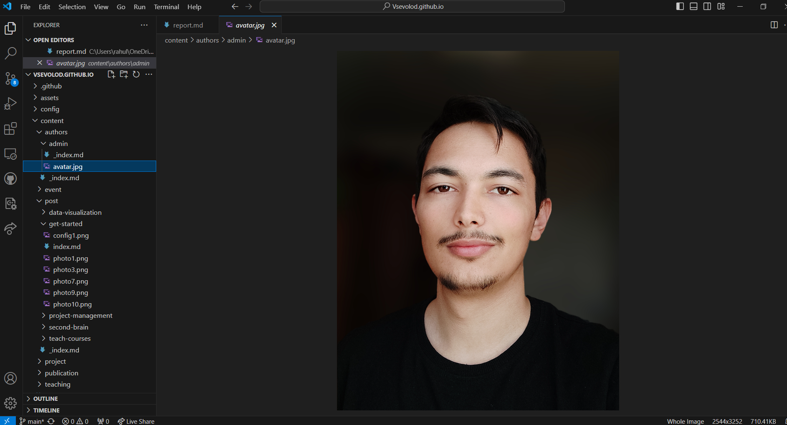

## Objective

Work with a previously created site. Learn how to add and edit personal information. Learn how to create new posts on the site.

## Task - Add personal information to the site.

### List of information to add.

- Upload a photo of the site owner.
- Add a brief biography of the site owner.
- Add information about interests.
- Add information about education.

### Create a post for the past week.

Add a post on a chosen topic:
- Version control. Git.
- Continuous Integration and Continuous Deployment (CI/CD).

## Task Execution

### I started by adding my personal information.

Using VSCode and the GitHub Pull Request extension, I began editing my information by opening the document at 
`D:\Vsevolod.github.io`

First, I uploaded a new file `avatar.jpg` with my photo.

- Next, I added my brief biography.

- Added information about my interests.

- Added information about education.

Afterward, I checked the changes on the site page to verify the result.

### Adding a Post

Next, I moved on to creating and publishing a new post.
I chose the topic "Creating an Account on GitHub."

And, as before, after adding the changes to the repository, I visited the site page where I found the published post.

Then I followed the link to check the post's display.

## Conclusions

As a result of this work, I learned how to edit personal information on the site, change the photo, and publish new posts.

