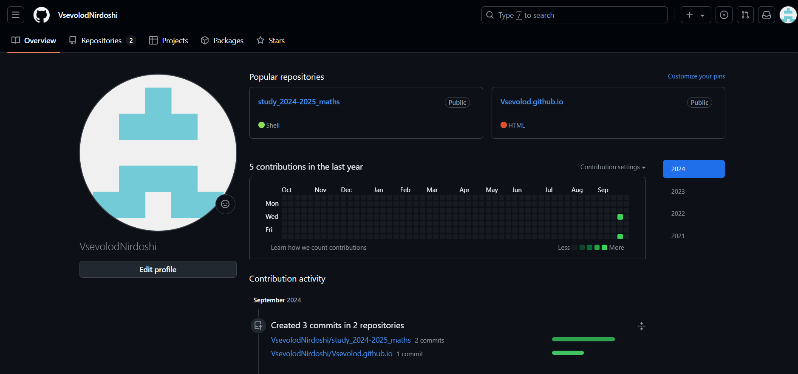
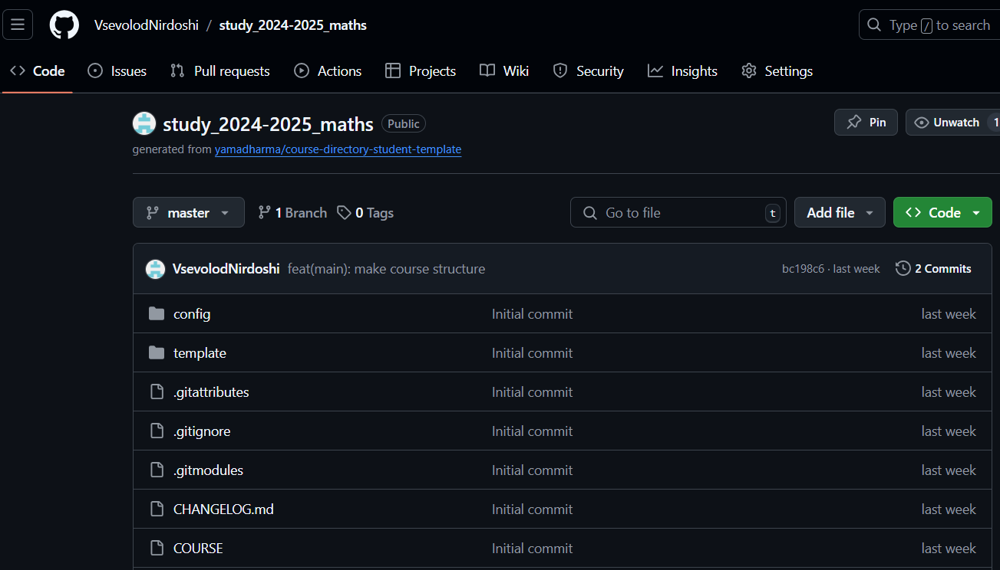

---

title: Creating an Account on GitHub
summary: Learn to work with the Git version control system. Familiarize yourself with and try basic configurations. Download data from the repository and modify it using Git functions.
date: 2024-09-21

authors:
  - admin
  - Ted

tags:
  - Academic
  - Hugo Blox
  - Markdown
---

## Objective

Learn to work with the Git version control system. Familiarize yourself with and try basic configurations. Download data from the repository and modify it using Git functions.

## Task

1) Register on GitHub.
2) Set up basic configuration for working with Git.
3) Create an SSH key.
4) Create a PGP key.
5) Configure Git signatures.
6) Create a local directory for assignments.

## Theoretical Introduction

#### Basic Git Configuration

`git config --global user.name "Name Surname"` - sets the repository owner's name

`git config --global user.email "work@mail"` - sets the repository owner's email

`git config --global core.quotepath false` - configures UTF-8 for Git message output

`git config --global init.defaultBranch master` - sets the initial branch name

`git config --global core.autocrlf input` - configures the autocrlf parameter

`git config --global core.safecrlf warn` - configures the safecrlf parameter

#### Commands for Creating SSH Keys

`ssh-keygen -t rsa -b 4096` - creates an RSA key with a length of 4096 bits

`ssh-keygen -t ed25519` - creates a key using the Ed25519 algorithm

#### Commands for Working with GPG Keys

`gpg --full-generate-key` - generates a GPG key with settings

`gpg --list-secret-keys --keyid-format LONG` - lists keys

`gpg --armor --export <PGP Fingerprint> | xclip -sel clip` - copies the key to the clipboard

#### Commands for Configuring Automatic Commit Signatures in Git

`git config --global user.signingkey <PGP Fingerprint>`

`git config --global commit.gpgsign true`

`git config --global gpg.program $(which gpg2)`

#### Course Directory Setup

`cd` - navigates to the target folder

`make` - creates a new folder/file

`rm` - deletes an unnecessary folder/file

***Uploading Files to the Server:***

`git add .`

`git commit -am 'feat(main): make course structure'`

`git push`

## Laboratory Work Execution

#### 1) Register on GitHub.

Creating an account on GitHub to upload the repository and interact with files through a saved copy on my computer. Profile link: https://github.com/VsevolodNirdoshi

#### 2) Set up basic configuration for working with Git.

###### ***Installing Software***

Installing Ubuntu.

###### ***Basic Git Configuration***

Setting up the owner's name and email, and configuring language parameters.

#### 3) Create an SSH key.

Creating SSH keys:
- using the RSA algorithm

#### 4) Create a PGP key.

Generating a GPG key with the following parameters:

– Type: RSA and RSA

– Size: 4096

– Expiration date: default is 0 (no expiration)

Adding keys to the GitHub account by navigating to GitHub's Settings/SSH and GPG Keys and adding them there.

Retrieving the private key fingerprint with a command.

To get the GPG key, I use the command replacing the phrase in brackets with the obtained private key fingerprint:
***gpg --armor --export <PGP Fingerprint>***
which displays the key.

#### 5) Configure Git signatures.

Setting up commit signature requirements.

#### 6) Create a local directory for assignments.

Creating a directory, deleting unnecessary files, and then uploading the repository to GitHub.

Checking the changes by visiting GitHub.

## Conclusions

During this work, I learned how to work with the Git version control system. I familiarized myself with and tried basic configurations, downloaded data from the repository, and modified it using Git functions.

## References{.unnumbered}

::: Laboratory Guide 1 {https://esystem.rudn.ru/pluginfile.php/2372898/mod_resource/content/5/002-lab_vcs.pdf}
::: Laboratory Guide 2 {https://esystem.rudn.ru/pluginfile.php/2372900/mod_resource/content/4/003-lab_markdown.pdf}