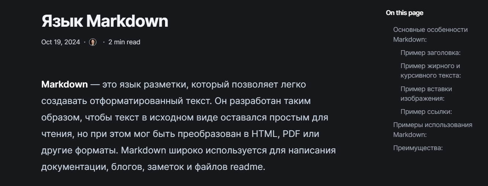

---

title: Add Achievements Information to the Site
summary: Create a post for the past week and also create a post on the topic "Markdown Markup Language."
date: 2024-11-02
authors:
  - admin
tags:
  - Hugo Blox
  - Markdown

---

## Objective

Add information about achievements to the site, create a post for the past week, and also create a post on the topic "Markdown Markup Language."

## Task

##### 1. Add achievements to the site.

##### List of Achievements:

  - Add information about skills.
  - Add information about experience.
  - Add information about accomplishments.

##### 2. Create a post for the past week.

##### 3. Create a post on the topic "Markdown Markup Language."

## Task Execution

##### 1. Added information about skills.

I started by adding the **Skills** section, where I listed my skills in various programming languages and technologies.

##### 2. Added information about experience.

Next, I added the **Experience** section.

##### 3. Added information about accomplishments.

In the **Accomplishments** section, I added information about receiving a certificate for developing a site for **Swiggy Online Food Ordering**.

#### Created a post for the past week.

#### Created a post on the topic "Markdown Markup Language."

Next, I began creating a new post. I chose the topic "Markdown Markup Language" and described the main elements of Markdown, such as headers, lists, links, and images.

After adding the post to the repository, I checked its display on the site page.

## Conclusions

During this work, I added information about my achievements to the site, including sections on skills, experience, and obtained certificates. I also created a post on the topic "Markdown Markup Language," where I discussed the basic principles of using Markdown for text formatting. I learned to update the site, add new posts, and check the publication results on the site page.