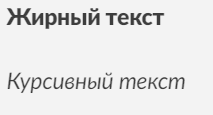

---

title: Markdown Language
summary: Markdown is a markup language that allows you to easily create formatted text.
date: 2024-09-21
authors:
  - admin
---

**Markdown** is a markup language that allows you to easily create formatted text. It is designed so that the raw text remains simple to read while still being convertible to HTML, PDF, or other formats. Markdown is widely used for writing documentation, blogs, notes, and README files.

### Key Features of Markdown:
1. **Simple Syntax**: Simple symbols are used to create headers, lists, links, and other formatting elements. For example, the `#` symbol creates headers, and `*` or `_` is used to italicize or bold text.
   
   #### Header Example:
   ```markdown
   # This is a first-level header
   ## This is a second-level header
   ```

2. **Minimal Rules**: Markdown uses a minimal set of rules, making it simple and accessible for everyone. For example, to make text **bold** or *italic*, you only need to add `**` or `*` symbols, respectively.
   
   #### Bold and Italic Text Example:
   ```markdown
   **This is bold text**
   *This is italic text*
   ```

3. **Image Support**: In Markdown, you can insert images using the following syntax: ``.
   
   #### Image Insertion Example:
   ```markdown
   
   ```
   As a result, an image with the specified URL will be inserted into the text.

4. **Wide Platform Support**: Markdown is supported by many platforms, such as GitHub, Jupyter Notebooks, and Bitbucket. It is often used to create documentation, README files, blogs, and articles.
   
   #### Link Example:
   ```markdown
   [Click here to visit the site](https://example.com)
   ```

5. **Flexibility**: Text written in Markdown can easily be converted to HTML, PDF, or Word, making it ideal for cross-platform work.

6. **Readability**: Markdown remains readable even without rendering. This means users can easily read and understand the raw text.

### Examples of Using Markdown:
- **Headers**: Use one or more `#` symbols to create headers of different levels.
  
  ```markdown
  # First-level header
  ## Second-level header
  ### Third-level header
  ```
  

- **Bold and Italic**: Wrap text in `**` or `*` for bold or italic fonts.
  
  ```markdown
  **Bold text**
  *Italic text*
  ```
  

- **Lists**: Use `-`, `+`, or `*` to create unordered lists and numbers with periods to create ordered lists.
  
  ```markdown
  - First item
  - Second item
  
  1. First element
  2. Second element
  ```
  

- **Images**: Use the syntax `` to insert images.
  
  ```markdown
  
  ```

- **Links**: To create hyperlinks, use `[Link Text](URL)`.

### Advantages:
- **Simple Syntax**: Easy to learn and use.
- **Flexibility**: Easily convertible to various formats (HTML, PDF, etc.).
- **Wide Support**: Supported on many platforms.
- **Readability**: Even the raw Markdown text is easy to read and understand.