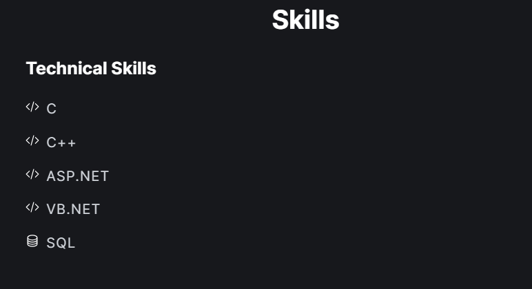
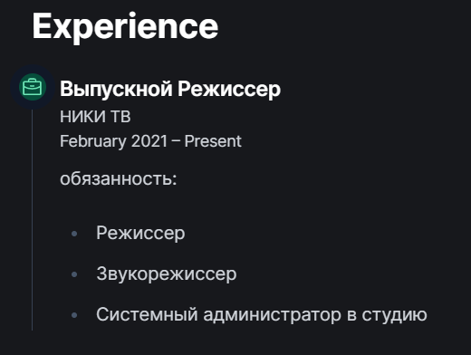
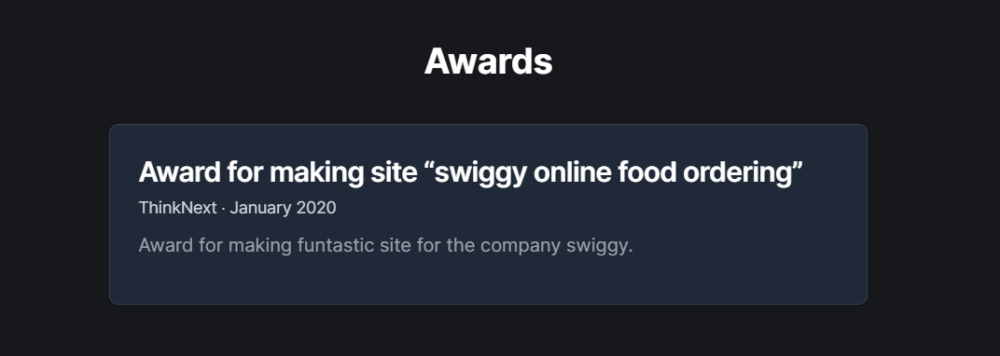
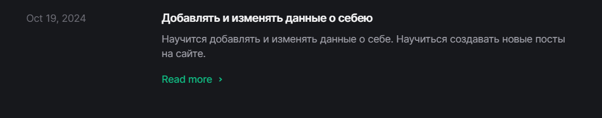
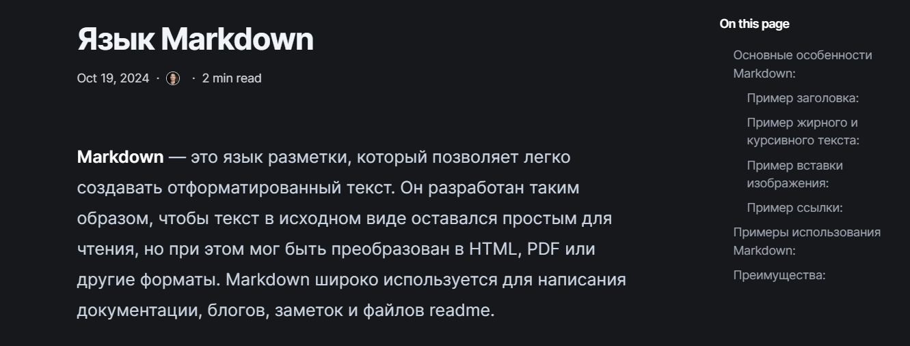

# Цель работы

  Добавить информацию о достижениях на сайт, Сделать пост по прошедшей неделе, а также создать пост на тему "Язык разметки Markdown".

# Задание

  ### 1. Добавить к сайту достижения.

  #### Список достижений:

    - Добавить информацию о навыках (Skills).
    - Добавить информацию об опыте (Experience).
    - Добавить информацию о достижениях (Accomplishments).

  ### 2. Создать пост по прошедшей неделе.

  ### 3. Создать пост на тему "Язык разметки Markdown"

# Выполнение работы

  ### 1. Добавил информацию о навыках (Skills).

  Я начал с добавления раздела **Skills**, где указал навыки работы с различными языками программирования и технологиями:

  

  ### 2. Добавил информацию об опыте (Experience).

  Следующим шагом я добавил раздел **Experience**.

  

  ### 3. Добавил информацию о достижениях (Accomplishments).

  В раздел **Accomplishments** я добавил информацию о полученном сертификате за разработку сайта для **Swiggy Online Food Ordering**.

  

  ## Сделать пост по прошедшей неделе.

  

  ## Создать пост на тему "Язык разметки Markdown"

  Далее я приступил к созданию нового поста. Для темы я выбрал "Язык разметки Markdown" и описал основные элементы Markdown, такие как заголовки, списки, ссылки и изображения.

  После добавления поста в репозиторий, я проверил его отображение на странице сайта.

  

 

# Выводы

В ходе этой работы я добавил информацию о своих достижениях на сайт, включая разделы о навыках, опыте и полученных сертификатах. Также я создал пост на тему "Язык разметки Markdown", в котором разобрал основные принципы использования Markdown для форматирования текста. Я научился обновлять сайт и добавлять новые посты, а также проверять результаты публикации на странице.

