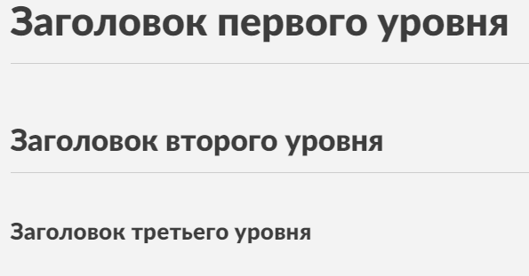
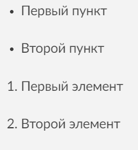

**Markdown** — это язык разметки, который позволяет легко создавать отформатированный текст. Он разработан таким образом, чтобы текст в исходном виде оставался простым для чтения, но при этом мог быть преобразован в HTML, PDF или другие форматы. Markdown широко используется для написания документации, блогов, заметок и файлов readme.

### Основные особенности Markdown:
1. **Простой синтаксис**: Для создания заголовков, списков, ссылок и других элементов форматирования используются простые символы. Например, символ `#` создает заголовки, `*` или `_` — для выделения текста курсивом или жирным шрифтом.
   
   #### Пример заголовка:
   ```markdown
   # Это заголовок первого уровня
   ## Это заголовок второго уровня
   ```

2. **Минимальный набор правил**: Markdown использует минимальный набор правил, что делает его простым и доступным для всех. Например, чтобы сделать текст **жирным** или *курсивным*, нужно всего лишь добавить символы `**` или `*` соответственно.
   
   #### Пример жирного и курсивного текста:
   ```markdown
   **Это жирный текст**
   *Это курсивный текст*
   ```

3. **Поддержка изображений**: В Markdown можно вставлять изображения, используя следующий синтаксис: ``.
   
   #### Пример вставки изображения:
   ```markdown
   
   ```
   В результате, изображение с указанным URL будет вставлено в текст:

4. **Широкая поддержка**: Markdown поддерживается множеством платформ, таких как GitHub, Jupyter Notebooks, Bitbucket. Его часто используют для создания документации, файлов readme, блогов и статей.
   
   #### Пример ссылки:
   ```markdown
   [Нажмите здесь, чтобы перейти на сайт](https://example.com)
   ```

5. **Гибкость**: Текст, написанный на Markdown, можно легко конвертировать в HTML, PDF или Word, что делает его идеальным для многоплатформенной работы.

6. **Читабельность**: Даже без рендеринга Markdown остается читаемым текстом. Это означает, что пользователи могут легко прочитать и понять текст в исходной разметке.

### Примеры использования Markdown:
- **Заголовки**: Использование одного или нескольких символов `#` для создания заголовков разных уровней.
  
  ```markdown
  # Заголовок первого уровня
  ## Заголовок второго уровня
  ### Заголовок третьего уровня
  ```
  

- **Жирный и курсив**: Оборачивание текста в `**` или `*` для жирного или курсивного шрифта.
  
  ```markdown
  **Жирный текст**
  *Курсивный текст*
  ```
  

- **Списки**: Используйте `-`, `+` или `*` для создания ненумерованных списков и числа с точками для создания нумерованных списков.
  
  ```markdown
  - Первый пункт
  - Второй пункт
  
  1. Первый элемент
  2. Второй элемент
  ```
  

- **Изображения**: Используйте синтаксис `` для вставки изображений.
  
  ```markdown
  
  ```

- **Ссылки**: Для создания гиперссылок используйте `[Текст ссылки](URL)`.

### Преимущества:
- **Простой синтаксис**: Легок в освоении и использовании.
- **Гибкость**: Можно легко конвертировать в различные форматы (HTML, PDF и т.д.).
- **Широкая поддержка**: Поддерживается на многих платформах.
- **Читабельность**: Даже исходный текст Markdown легко читаем и понятен.