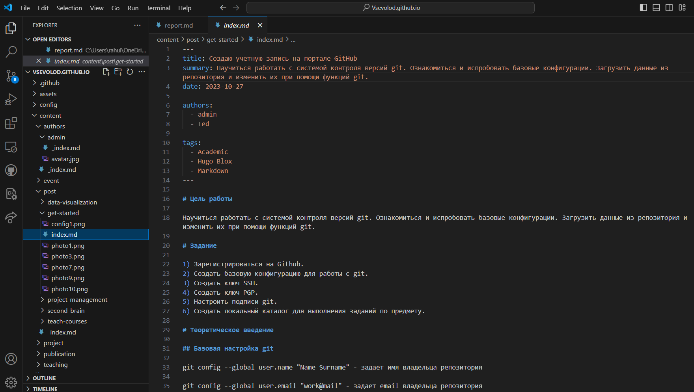
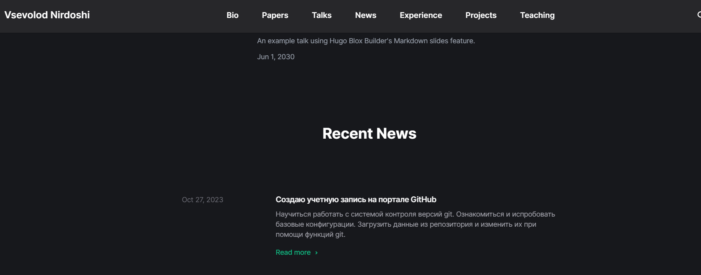
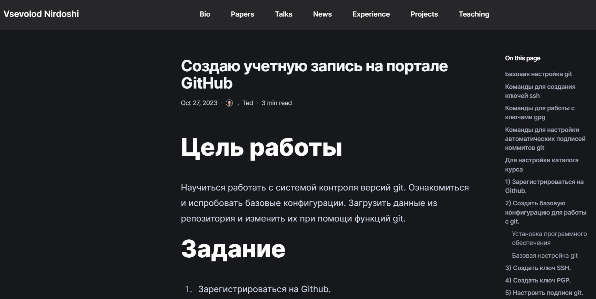

# Цель работы

Провести работу с ранее созданным сайтом. Научится добавлять и изменять данные о себе. Научиться создавать новые посты на сайте.

# Задание - добавить к сайту данные о себе.

## Список добавляемых данных.

- Разместить фотографию владельца сайта.
- Разместить краткое описание владельца сайта (Biography).
- Добавить информацию об интересах (Interests).
- Добавить информацию от образовании (Education).

## Сделать пост по прошедшей неделе.

Добавить пост на тему по выбору:
- Управление версиями. Git.
- Непрерывная интеграция и непрерывное развертывание (CI/CD).

# Выполнение работы

## Я начал работу с добавления данных о себе.

Используя VScode и установленный в него GitHub Pull Request начал редактировать данные о себе открыв документ 
D:\Vsevolod.github.io

Первым делом разместил новый файл avatar.jpg со своеё фотографией.

- Далее разместил своё краткое описание (Biography).

- Добавил информацию о своих интересах (Interests).

- И добавил информацию об образовании (Education).

После зашел и проверил изменение на странице сайта, для того, чтобы проверить результат

## Добавление поста

Далее я перешел к созданию нового поста и его публикации.
Для поста я выбрал тему "Создаю учетную запись на портале GitHub"

И также как и ранее после добавления изменений в репозиторий, зашел на страницу сайта где нашёл опубликованный пост

И перейдя по ссылке проверил результат отображения написанного поста

# Выводы

В результате проделанной работы я научился редактировать личную инфомацию на сайте, менять фотографию, а также публиковать новые посты. 

